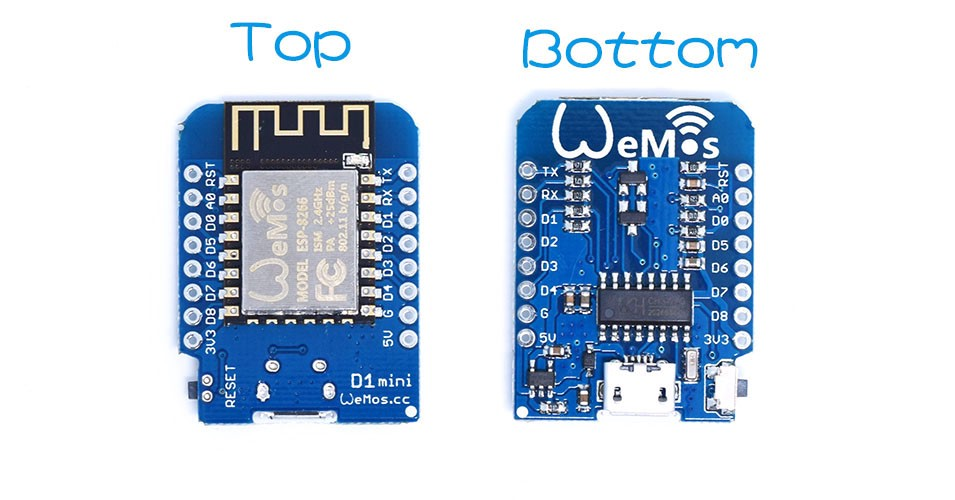
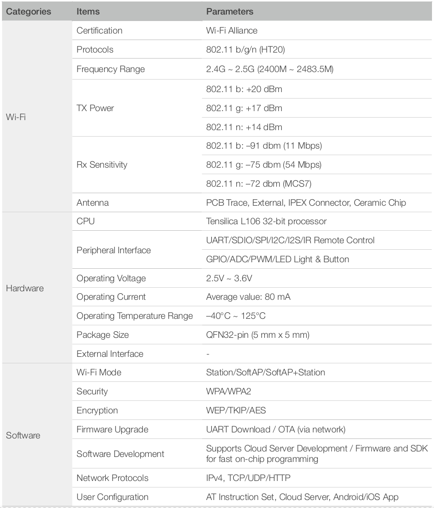

# Electronica necesaria relacionada con Arduino

## Placa base: D1 Mini (WeMoS, NodeMCU)

Pagina oficial de la placa [wemos.cc](https://wiki.wemos.cc/products:d1:d1_mini)

Basada en el chip [ESP8266EX](media/ESP8266EX_datasheet_en.pdf)

Caracteristicas:

## Tablas comparativas de precios por tipo de modulo

Para poder calcular adecuadamente los gastos se ha hecho una busqueda de los elementos que sirven o puedan servir para el proyecto.

Se han ordenado por precio unitario de menor a mayor, y se ha incluido la columna del vendedor para el caso que se intente comprar por lote.

Debido al precio o a la tardanza del envio, apenas se muestran modulos compatibles directamente con el D1 (apilado vertical). La forma de conectarlos a la placa base sera mediante cableado o una PCB de adaptacion (es posible hacerla mediante placas pre-taladradas de prototipado: [Genericas](https://www.amazon.es/s/ref=nb_sb_noss_2?__mk_es_ES=%C3%85M%C3%85%C5%BD%C3%95%C3%91&url=search-alias%3Daps&field-keywords=pcb+prototipo&rh=i%3Aaps%2Ck%3Apcb+prototipo) o [compatibles con D1 mini](https://www.amazon.es/dp/B07F6C3DF8/ref=cm_sw_r_tw_dp_U_x_3qiwCbSAV2RZA))

La ventaja de los modulos con linea unica es que pueden montarse en vertical sin nigun problema, por lo que se pueden condensar varias placas en la vertical de la placa base.

### Placa base: D1 Mini

| Vendedor   | Item    | Cantidad | Precio  | Precio Ud. | Link Amazon                                                                     |
| :-----:    | :-----: | :-----:  | :-----: | :-----:    | :-----:                                                                         |
| IZOKEE     | D1 Mini | 5        | 22.99   | 4.6        | [Link](https://www.amazon.es/dp/B076F81VZT/ref=cm_sw_r_tw_dp_U_x_FnhwCbJXNS727) |
| IZOKEE     | D1 Mini | 3        | 14.99   | 5          | [Link](https://www.amazon.es/dp/B076F53B6S/ref=cm_sw_r_tw_dp_U_x_Y5hwCbAY80Q19) |
| AZDelivery | D1 Mini | 5        | 24.99   | 5          | [Link](https://www.amazon.es/dp/B0754W6Z2F/ref=cm_sw_r_tw_dp_U_x_v5hwCbSC78N0C) |
| AZDelivery | D1 Mini | 3        | 17.99   | 6          | [Link](https://www.amazon.es/dp/B0754N794H/ref=cm_sw_r_tw_dp_U_x_17hwCbJE01X3R) |

### Placa esclavo 1: Micro-SD para data-logger

| Vendedor  | Item                      | Cantidad | Precio  | Precio Ud. | Link Amazon                                                                     | Pinout compatible D1 Mini |
| :-----:   | :-----:                   | :-----:  | :-----: | :-----:    | :-----:                                                                         | :-----:                   |
| ILS       | Modulo uSD con 1xLDO      | 10       | 12.69   | 1.27       | [Link](https://www.amazon.es/dp/B079124Z4G/ref=cm_sw_r_tw_dp_U_x_9kgwCbS7D4XS3) | No, linea doble           |
| Electrely | Modulo uSD con 2xLDO      | 5        | 8.99    | 1.80       | [Link](https://www.amazon.es/dp/B07G296J2M/ref=cm_sw_r_tw_dp_U_x_RjgwCbAC8SWAE) | No, linea unica           |
| TECNOIOT  | Modulo uSD con 2xLDO      | 5        | 9.48    | 1.90       | [Link](https://www.amazon.es/dp/B07LH6DH9D/ref=cm_sw_r_tw_dp_U_x_plgwCb481VT7A) | No, linea unica           |
| ILS       | Modulo Wemos uSD (no LDO) | 5        | 13.29   | 2.66       | [Link](https://www.amazon.es/dp/B07F6CF6YD/ref=cm_sw_r_tw_dp_U_x_FZfwCbXXAGKNK) | Si                        |

### Placa esclavo 2: Sensor de temperatura y humedad

| Vendedor | Item               | Cantidad | Precio  | Precio Ud. | Link Amazon                                                                     | Pinout compatible D1 Mini |
| :-----:  | :-----:            | :-----:  | :-----: | :-----:    | :-----:                                                                         | :-----:                   |
| DollaTek | Modulo DHT11       | 5        | 8.99    | 1.8        | [Link](https://www.amazon.es/dp/B07DK8MVNX/ref=cm_sw_r_tw_dp_U_x_FagwCbN7YP2E2) | No, linea unica           |
| ILS      | Modulo Wemos DHT12 | 10       | 26.99   | 2.7        | [Link](https://www.amazon.es/dp/B07FCJY5FZ/ref=cm_sw_r_tw_dp_U_x_hYfwCbA1C7WDR) | Si                        |

### Placa esclavo 3: Sensor barometrico

| Vendedor    | Item          | Cantidad | Precio  | Precio Ud. | Link Amazon                                                                     | Pinout compatible D1 Mini |
| :-----:     | :-----:       | :-----:  | :-----: | :-----:    | :-----:                                                                         | :-----:                   |
| MissBirdler | Modulo BMP180 | 5        | 14.49   | 2.9        | [Link](https://www.amazon.es/dp/B07GNKWWWF/ref=cm_sw_r_tw_dp_U_x_BggwCbCETKDP7) | No, linea unica           |
| AZDelivery  | Modulo BMP280 | 5        | 15.96   | 3.2        | [Link](https://www.amazon.es/dp/B07HMWB4PD/ref=cm_sw_r_tw_dp_U_x_gfgwCbZTN68BG) | No, linea unica           |

### Placa esclavo 2 + 3: Sensor de temperatura, humedad y presion

| Vendedor   | Item          | Cantidad | Precio  | Precio Ud.         | Link Amazon                                                                     | Pinout compatible D1 Mini |
| :-----:    | :-----:       | :-----:  | :-----: | :-----:            | :-----:                                                                         | :-----:                   |
| AZDelivery | Modulo BME280 | 5        | 26.12   | 5.23 (+0.53/-0.67) | [Link](https://www.amazon.es/dp/B07HMQMW6M/ref=cm_sw_r_tw_dp_U_x_BDhwCbJR0T7HB) | No, linea unica           |
| diymore    | Modulo BME280 | 5        | 26.99   | 5.4 (+0.7/-0.5)    | [Link](https://www.amazon.es/dp/B0799FH5PG/ref=cm_sw_r_tw_dp_U_x_0DhwCbT54YETR) | No, linea unica           |

### Placa esclavo 4: Giroscopo de 3 ejes y acelerometro de 3 ejes

| Vendedor    | Item            | Cantidad | Precio  | Precio Ud. | Link Amazon                                                                     | Pinout compatible D1 Mini |
| :-----:     | :-----:         | :-----:  | :-----: | :-----:    | :-----:                                                                         | :-----:                   |
| MUZOCT      | Modulo MPU-6050 | 6        | 14.29   | 2.4        | [Link](https://www.amazon.es/dp/B07D7SSTFW/ref=cm_sw_r_tw_dp_U_x_iWhwCbYCAJV6C) | No, linea unica           |
| Kuman       | Modulo MPU-6050 | 10       | 31.99   | 3.2        | [Link](https://www.amazon.es/dp/B01N96D51D/ref=cm_sw_r_tw_dp_U_x_WOhwCbS8G4XTD) | No, linea unica           |
| Gikfun      | Modulo MPU-6050 | 3        | 13.31   | 4.43       | [Link](https://www.amazon.es/dp/B07FVKWJF6/ref=cm_sw_r_tw_dp_U_x_SUhwCbPK351RC) | No, linea unica           |
| MissBirdler | Modulo MPU-6050 | 3        | 13.37   | 4.46       | [Link](https://www.amazon.es/dp/B07GNJLN46/ref=cm_sw_r_tw_dp_U_x_VRhwCbA2Q11TK) | No, linea unica           |