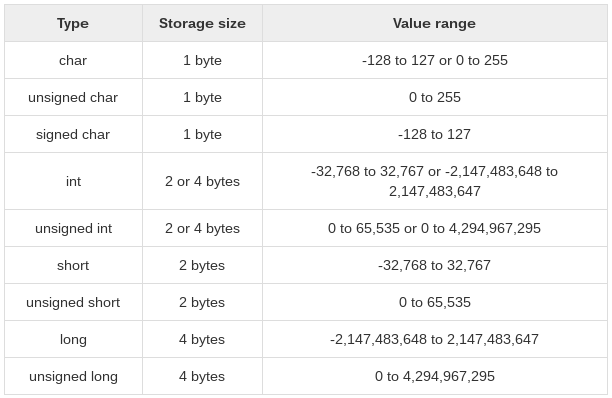
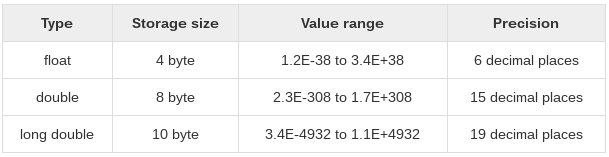

# Objetivos

- Cómo escribir programas en C
  + Compilar `Hello World`
- Tipos de datos
  + Básicos
  + Enumerados
  + Tipo `void`
  + Derivados

---

# Cómo escribir programas en C

```c
/* Include required headers here */
#include <stdio.h>

/** Double asterisk comments: Documentation for coders and end-user */
/* Single asterisk comments: Documentation for coders */
// Dash comments: Temporary comments for notes, commented lines, ...

int main(int argc, char *argv[])
{
  /* Print a string to stdout (screen) */
  printf("Hello World!\n");

  /* Return status to caller. 0 is OK, error otherwise */
  return 0;
}
```

---

# Cómo escribir programas en C: Tipos de ficheros básicos

## Código fuente (extensión `.c`)

- Cuerpo del programa y de sus funciones
- Se reserva y se hace uso de la memoria
- Es obligatorio

## Encabezados (extensión `.h`)

- Referencias 

---

# Cómo escribir programas en C: Compilar `Hello World`

- Para compilar este primer ejemplo se hará uso de las herramientas de GNU, concrétamente del compilador de C de GNU (`gcc`).

**Ejemplo mínimo funcional**

```shell
gcc fuente.c
```

**Ejemplo mejorado y con mucha información extra** (verbose)

```shell
gcc -v -o my_app fuente1.c fuente2.c
```

---

# Tipos de datos

- En C, una variable siempre lleva asociado un único tipo de dato, que definirá:
  + Espacio que ocupan las variables en el almacenamiento
  + Patrón de bits a la hora de escribir o leer

---

# Tipos de datos: Básicos (aritméticos)

- Enteros
- De punto flotante

---

# Tipos de datos: Resumen de enteros



---

# Tipos de datos: Resumen de punto flotante



---

# Tipos de datos: Enumerados

- Este tipo se utiliza para las variables donde se usen un numero discreto de valores.
- Será de tipo entero siempre

```c
enum week {Mon, Tue, Wed, Thur, Fri, Sat, Sun};
```

```c
enum week day; 
day = Wed; 
```

---

# Tipos de datos: Tipo `void`

- Son un tipo de datos especial para indicar que no hay valor
  + Funciones que no necesitan indicar un valor de retorno
  + Funciones que no necesitan ningún argumento
  + Punteros: Representan la dirección de un objeto, pero no su tipo

---

# Tipos de datos: Derivados

- Punteros
- Arrays/Listas/Matrices/...
- Estructuras
- Uniones
- Funciones
