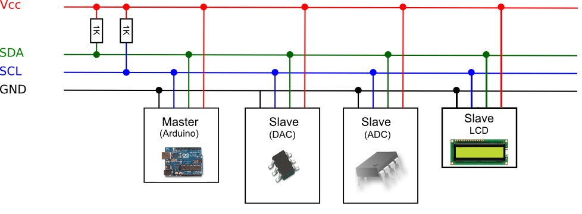

# Práctica 2 - El bus I2C

A medida que la capacidad integración en un único chip aumentaba, el número de componentes comerciales disponibles, aumentaba exponencialmente. Cada vez era, y es, más sencillo fabricar bloques de construcción electrónicos integrados en un único chip, y pronto el grosor de los catálogos de los fabricantes, engordó peligrosamente.

Era relativamente fácil encontrar esos bloques de construcción pero cuando tu diseño requería usar una docena de esos bloques, ponerlos de acuerdo y conseguir que se comunicaran eficazmente, se convirtió en un problema.

Por eso, en los primeros 80, uno de los grandes fabricantes de electrónica (Phillips), propuso una norma de comunicación digital, entre los diferentes componentes de una sistema electrónico.

Una norma que especificaba la velocidad, niveles de tensión, y el protocolo a seguir para conseguir esa comunicación y la hizo abierta.

Esa norma se llamó Inter Integrated Circuits bus, o IIC, y pronto se convirtió en un estándar de facto en la industria. Las especificaciones han ido mejorando con los años, pero la idea básica sigue siendo la misma:
 
* Protocolo de dos hilos de control, uno para transmitir los datos, SDA y otro, el reloj asíncrono que indica cuando leer los datos SCL. Mas GND y 5V (cuando se requiera).
* Cada dispositivo conectado al bus I2C y cada uno tiene su dirección exclusiva, de 7 bits, (Asi que, en teoría, podemos conectar 27 = 128, dispositivos).
* Uno de estos componentes, debe actuar como master, es decir controla el reloj.
* No se requiere una velocidad de reloj estricta, ya que es el master quien controla el Clock.
* Es multi master, el master puede cambiar, pero solo uno puede estar activo a la vez, y proporciona un protocolo de arbitraje y detección de colisiones. (Si no has entendido esto, no te preocupes, todavía es pronto).

Puedes encontrar que a este bus se le llama I2C, IIC o I2C, y también, como TWI (Two Wire Interface, o interface de 2 hilos), pero siempre es lo mismo.



La idea es que todos los componentes se conecten en paralelo a las dos líneas del bus, SDA y SCL. En cada momento solo puede haber un master, en este caso, nuestro Arduino, y los demás se configuran como esclavos.

* Puede haber más de un master. La norma propone un sistema de arbitraje, para transferir el control de uno a otro, pero en un instante dado, solo uno puede ser el master.
* Atención a las resistencias de Pullup conectadas a SDA y SCL. Son imperativas, ya que el bus es activo bajo (Esto es, la señal activa es un 0, no un 1. Pero tranquilo, que esto no te afecta)
* Al conectar algo al bus I2C, es imprescindible que leas el manual para saber si los pullups los tienes que poner tú, o vienen puestos en el componente.
* En el caso del montaje entregado, ya existe una doble pull-up de 10 KOhm (y por lo tanto, resultante en 5K, por lo que en principio se debería admitir hasta 400 kHz en el bus).

Y la buena noticia es que nuestro Arduino lo soporta de fábrica con una librería estándar, que utiliza dos de los pines analógicos para las funciones SDA (Datos) y SCL (Clock).

* En el `Arduino UNO`, los pines I2C están en los pines analógicos A4 (SDA) y A5 (SCL)
* En el `Arduino Mega` y DUE, son el 20 (SDA) y en el 21(SCL)
* En el `WeMos D1 Mini` entregado, son el 0 (SDA) y en el 2(SCL)

La librería I2C, en Arduino se llama Wire, y gestiona el protocolo de comunicaciones completo, lo que es un detalle, pues nos ahorra la parte de estudiar el protocolo y escribir programas para ello (maquina de estados a bajo nivel).

* Esto es una practica habitual y recomendada, construir sobre el trabajo de terceros. Es una de las muy grandes virtudes de la comunidad Arduino y open source.
* Hay una gama muy amplia de librerias que dan soporte a muchisimos dispositivos, o crean funcionalidades nuevas, ...
* Se recomienda buscar, probar y sacar conclusiones para ver tanto la calidad como el posible uso.

Se espera que tras este ejercicio se consiga comunicar con el sensor BME280 integrado en el montaje entregado.

## Programa

Se parte de la anterior sesión, donde un programa enviaba por puerto serie 3 variables, para luego verlas o dibujarlas mediante el monitor serie o el plotter, respectivamente.

> **NOTA**: La documentación oficial de la libreria `Wire` de Arduino puede encontrarse en [https://www.arduino.cc/en/reference/wire](https://www.arduino.cc/en/reference/wire)

> **NOTA**: Toda la información de las librerias del ESP8266 para Arduíno pueden encontrarse en [https://arduino-esp8266.readthedocs.io/en/latest/libraries.html](https://arduino-esp8266.readthedocs.io/en/latest/libraries.html)

> **NOTA**: Toda la información referente al sensor BME280 que trataremos puede encontrarse en su datasheet en [BME280.pdf](BME280.pdf)

Para poder comenzar con el uso de las funciones de I2C es necesario incluir la cabecera de la libreria `Wire`, al principio de nuestro programa, de la siguiente forma:

```C
#include <Wire.h>

void setup() {
  // join i2c bus (address optional for master)
  Wire.begin(0, 2);

  // start serial for output
  Serial.begin(9600);
}

void loop() {
  // request 6 bytes from slave device #8
  Wire.requestFrom(8, 6);

  // slave may send less than requested
  while (Wire.available())
  {
    // receive a byte as character
    char c = Wire.read();

    // print the character
    Serial.printf("Received: %02X\n", c);
  }

  delay(500);
}
```
