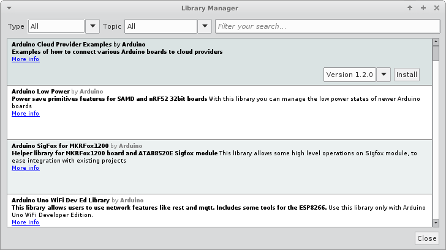

# Práctica 3 - Uso de librerías

Tras aprender lo que es el bus I2C y como acceder a los datos en bruto de un dispositivo, en esta práctica se usará una libreria para que haga ese mismo trabajo.

Esto supone una primera ventaja clara: en lugar de necesitar saber los pormenores de un chip, ahora solo será necesario saber cómo se usan las funciones de una librería.

## Introducción

Una libreria es uno o varios ficheros de código en donde ya hay programadas ciertas funcionalidades y se incluyen en el código en forma de paquete, lo que:

* Simplificará enormemente el proceso de desarrollo
* Incrementará la calidad y legibilidad del código final
* Necesitará de mucho menos tiempo para obtener los mismos resultados
* Evitará errores innecesarios, pues normalmente han pasado muchas pruebas
* Si una libreria falla suele haber alternativas

Aunque no se haya estudiado en profundidad, esto ya se ha utilizado en los programas del taller en el momento que se usa, por ejemplo, `#include <Wire.h>`.

Lo que realmente se está haciendo es incluir la cabecera de la librería `Wire`, que dará a conocer al programa una serie de variables, funciones, clases, etc. De esta forma pasan a estar disponibles, y por lo tanto, su funcionalidad.

Dicho de otro modo, la librería `Wire` evita tener que leer uno o varios datasheets de un microcontrolador para saber cómo hacer funcionar el bus I2C en su forma mas basica.

> Sin la libreria `Wire` sería necesario programar funciones como `Wire.requestFrom()` o `Wire.read()`, lo que haría prácticamente inviable desarrollos a corto plazo.

La siguiente figura muestra el modelo de capas de abstracción que se está usando:


Para el caso del sensor BME280, supondría una gran ventaja disponer de una librería que ya hiciera todo el trabajo de pedir los datos y convertirlos, con tan solo definir los parámetros básicos del bus I2C y dirección de esclavo ... y es lo que se verá a continuación.

## Como continuar

Lo primero es buscar y estudiar las posibilidades, y para esto Arduino facilita la tarea mediante un gestor de librerias, al que se accede a través de *Herramientas > Gestor de librerias ...*, obteniendo algo como en la siguiente figura:



Como se continuará con el sensor BME280, se pone como filtro de búsqueda, lo que resultará en algo como:


> Para la práctica se ha seleccionado la de **SparkFun Electronics**, por ser una de las mas completas, configurables y robustas. Esto no significa que no se pueda buscar información del resto, probarlas, y sacar conclusiones propias.

## Práctica

En esta práctica se busca conseguir una lectura total del sensor BME280 mediante el uso de la librería propuesta.

> Para poder estudiar su uso, ver la [<i class="fa fa-link" style="color:#FA023C"></i> documentación sobre la librería BME280 de SparkFun](https://github.com/sparkfun/SparkFun_BME280_Arduino_Library)

### Configuración y primera lectura

Por ahora, se proporciona únicamente la configuración, dejando como tarea continuar con el programa ... tras ver lo que dicen sus diseñadores (documentación, ejemplos, ...)

```C
/* Include required headers and/or libraries */
#include <Wire.h>
#include "SparkFunBME280.h"

#define SLAVE_ADDRESS 0x76

/* Instantiate a BME280 object called BME280_obj */
BME280 BME280_obj;

/*
 * Single-pass function to configure the app
 */
void setup()
{
  /* Start serial for output */
  Serial.begin(115200);

  /* Join I2C bus and set it to 400 kHz */
  Wire.begin(0, 2);
  Wire.setClock(400000);

  /* Address the sensor */
  BME280_obj.setI2CAddress(SLAVE_ADDRESS);

  /* Check communication before continue */
  if (BME280_obj.beginI2C(Wire) == false)
  {
    Serial.printf("The sensor did not respond. Please check wiring.\n");
    
    /* Stop here (WDT will reset at some point) */
    while(1);
  }
}

/*
 * Recurrent task, called forever
 */
void loop()
{
  /* Welcome message! Useful as a control point */
  Serial.printf("Ahoy! ESP8266 here!\n---\n");

  /* ~~~~~~~~~~~~~~~~~~~~~~~~~~~~~~~~~~~~~~~~~~~~~~~
   *  Ask for the data and print to console here !!
   * ~~~~~~~~~~~~~~~~~~~~~~~~~~~~~~~~~~~~~~~~~~~~~~~ */

  /* Ensure not to flood with a huge amount of fast data */
  delay(500);
}
```
