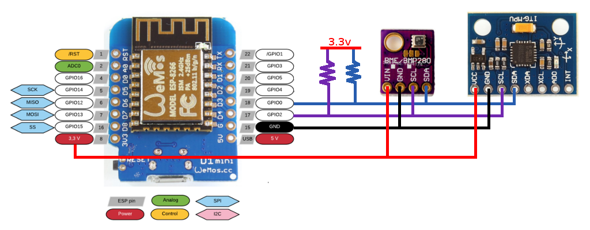
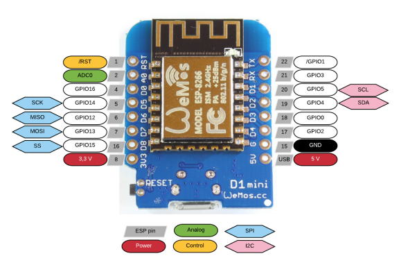
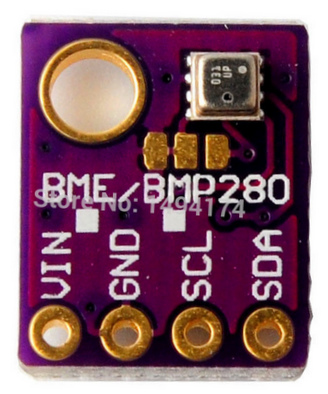
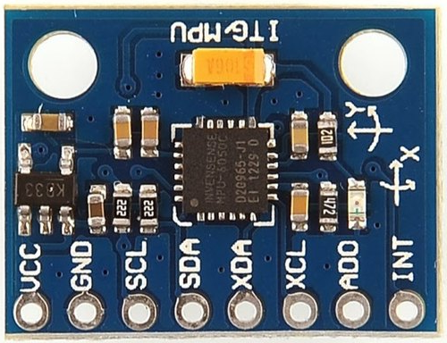

# Hardware

Tras analizar la oferta actual de placas de desarrollo soportados por Arduino, en base a su conectividad, tamaño y peso, se optó por la placa **D1 Mini** de **WeMos**, basada en un chip **ESP8266**.

En líneas generales esta placa ofrece un equilibrio entre tamaño y peso frente a conectividad y posibilidades, ya que aparte de integrar un chipset Wi-Fi, es posible programarla sin ningún dispositivo extra y gracias a su arquitectura interna, prácticamente todos los GPIOs son reprogramables, pudiendose intercambiar las funcionalidades de Serie, I2C, SPI, ...

Tambien se estudia que sensórica añadir, siempre que estuviera disponible en formato placa de desarrollo para evitar la soldadura SMD, seleccionando finalmente los sensores BME280 y MPU6050, temperatura/humedad/presion y acelerómetro/giróscopo, respectivamente.

Puesto que no se necesita ningún otro elemento para que pueda funcionar, se monta cada sensor en el bus I2C, que desde el punto de vista esquemático queda como:

A continuación se presenta información básica y enlaces a documentación de cada uno de los elementos, siendo lo necesario para poder entenderlos y programarlos adecuadamente.

## Microcontrolador ESP8266

> Descargar [<i class="fa fa-cloud-download-alt" style="color:#FA023C"></i> hoja de datos completa ESP8266EX](ESP8266EX_datasheet_en.pdf)

Se indican a continuación las caracteristicas generales del micro:

### Wi-Fi

| Items | Parameters |
| :----- | :----- |
| Certification | Wi-Fi Alliance |
| Protocols | 802.11 b/g/n (HT20) |
| Frequency Range | 2.4G ~ 2.5G (2400M ~ 2483.5M) |
| TX Power | 802.11 b: +20 dBm |
| | 802.11 g: +17 dBm |
| | 802.11 n: +14 dBm |
| Rx Sensitivity | 802.11 b: –91 dbm (11 Mbps) |
| | 802.11 g: –75 dbm (54 Mbps) |
| | 802.11 n: –72 dbm (MCS7) |
| Antenna | PCB Trace, External, IPEX Connector, Ceramic Chip |

### Hardware

| Items | Parameters |
| :----- | :----- |
| CPU | Tensilica L106 32-bit processor |
| Peripheral Interface | UART/SDIO/SPI/I2C/I2S/IR Remote Control |
| | GPIO/ADC/PWM/LED Light & Button |
| Operating Voltage | 2.5V ~ 3.6V |
| Operating Current | Average value: 80 mA |
| Operating Temperature Range | –40°C ~ 125°C |
| Package Size | QFN32-pin (5 mm x 5 mm) |
| External Interface | - |

### Software

| Items | Parameters |
| :----- | :----- |
| Wi-Fi Mode | Station/SoftAP/SoftAP+Station |
| Security | WPA/WPA2 |
| Encryption | WEP/TKIP/AES |
| Firmware Upgrade | UART Download / OTA (via network)  |
| Software Development | Supports Cloud Server Development / Firmware and SDK  |for fast on-chip programming
| Network Protocols | IPv4, TCP/UDP/HTTP |
| User Configuration | AT Instruction Set, Cloud Server, Android/iOS App |

## Placa base: WeMos D1 Mini

> Descargar [<i class="fa fa-cloud-download-alt" style="color:#FA023C"></i> esquemático D1 Mini](esp8266-wemos-d1-mini-pinout_schematic_v3.0.0.pdf)
>
> [<i class="fa fa-link" style="color:#FA023C"></i> Pagina oficial de la placa D1 Mini](https://wiki.wemos.cc/products:d1:d1_mini)

### Dónde comprar

| Item    | Cantidad | Precio  | Precio Ud. | Ancho (mm) | Alto (mm) | Grosor (mm) | Peso (g) | Link Amazon                                                                     |
| :-----: | :-----:  | :-----: | :-----:    | :-----:    | :-----:   | :-----:     | :-----:  | :-----:                                                                         |
| D1 Mini | 5        | 22.99   | 4.6        | 25.6       | 34.2      | 10          | 3        | [Link](https://www.amazon.es/dp/B076F81VZT/ref=cm_sw_r_tw_dp_U_x_FnhwCbJXNS727) |
| D1 Mini | 3        | 14.99   | 5          | 25.6       | 34.2      | 10          | 3        | [Link](https://www.amazon.es/dp/B076F53B6S/ref=cm_sw_r_tw_dp_U_x_Y5hwCbAY80Q19) |

## Sensor BME280: Temperatura, humedad y presion

> Descargar [<i class="fa fa-cloud-download-alt" style="color:#FA023C"></i> hoja de datos completa BME280](BME280_datasheet_en.pdf)

### Dónde comprar

| Item          | Cantidad | Precio  | Precio Ud.         | Pinout compatible D1 Mini | Ancho (mm) | Alto (mm) | Grosor (mm) | Peso (g) | Link Amazon                                                                     |
| :-----:       | :-----:  | :-----: | :-----:            | :-----:                   | :-----:    | :-----:   | :-----:     | :-----:  | :-----:                                                                         |
| Modulo BME280 | 5        | 26.12   | 5.23 (+0.53/-0.67) | No, linea unica           | 10         | 12        | 5           | 1        | [Link](https://www.amazon.es/dp/B07HMQMW6M/ref=cm_sw_r_tw_dp_U_x_BDhwCbJR0T7HB) |
| Modulo BME280 | 5        | 26.99   | 5.4 (+0.7/-0.5)    | No, linea unica           | 10         | 12        | 5           | 1        | [Link](https://www.amazon.es/dp/B0799FH5PG/ref=cm_sw_r_tw_dp_U_x_0DhwCbT54YETR) |

## Sensor MPU6050: Giroscopo de 3 ejes y acelerómetro de 3 ejes

> Descargar [<i class="fa fa-cloud-download-alt" style="color:#FA023C"></i> hoja de datos parcial MPU6050](MPU-6050_DataSheet_V3 4.pdf)
> 
> Descargar [<i class="fa fa-cloud-download-alt" style="color:#FA023C"></i> mapa de registros MPU6050](MPU-6000-Register-Map1.pdf)

### Dónde comprar

| Item            | Cantidad | Precio  | Precio Ud. | Pinout compatible D1 Mini | Ancho (mm) | Alto (mm) | Grosor (mm) | Peso (g) | Link Amazon                                                                     |
| :-----:         | :-----:  | :-----: | :-----:    | :-----:                   | :-----:    | :-----:   | :-----:     | :-----:  | :-----:                                                                         |
| Modulo MPU-6050 | 6        | 14.29   | 2.4        | No, linea unica           | 20         | 16        | 5           | 1        | [Link](https://www.amazon.es/dp/B07D7SSTFW/ref=cm_sw_r_tw_dp_U_x_iWhwCbYCAJV6C) |
| Modulo MPU-6050 | 10       | 31.99   | 3.2        | No, linea unica           | 20         | 16        | 5           | 1        | [Link](https://www.amazon.es/dp/B01N96D51D/ref=cm_sw_r_tw_dp_U_x_WOhwCbS8G4XTD) |
| Modulo MPU-6050 | 3        | 13.31   | 4.43       | No, linea unica           | 20         | 16        | 5           | 1        | [Link](https://www.amazon.es/dp/B07FVKWJF6/ref=cm_sw_r_tw_dp_U_x_SUhwCbPK351RC) |
| Modulo MPU-6050 | 3        | 13.37   | 4.46       | No, linea unica           | 20         | 16        | 5           | 1        | [Link](https://www.amazon.es/dp/B07GNJLN46/ref=cm_sw_r_tw_dp_U_x_VRhwCbA2Q11TK) |
